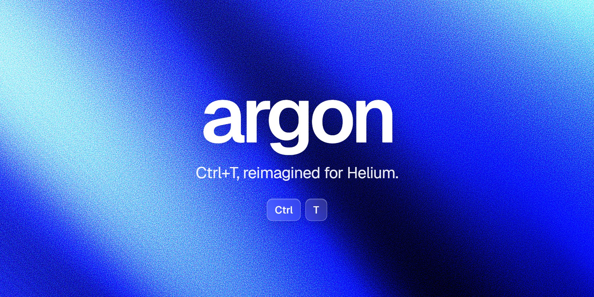
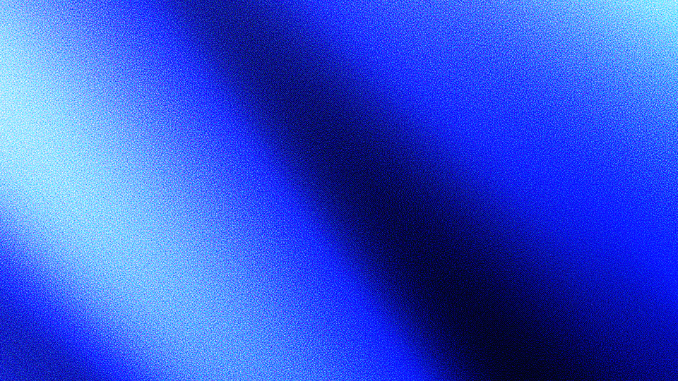
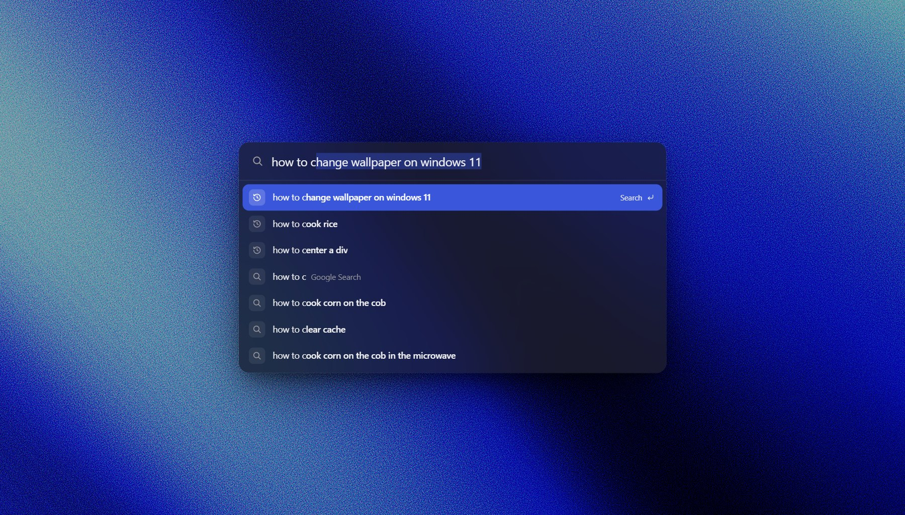
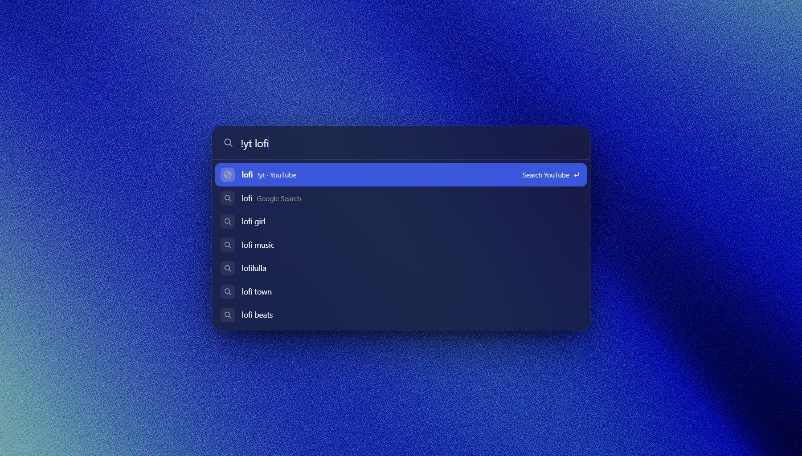
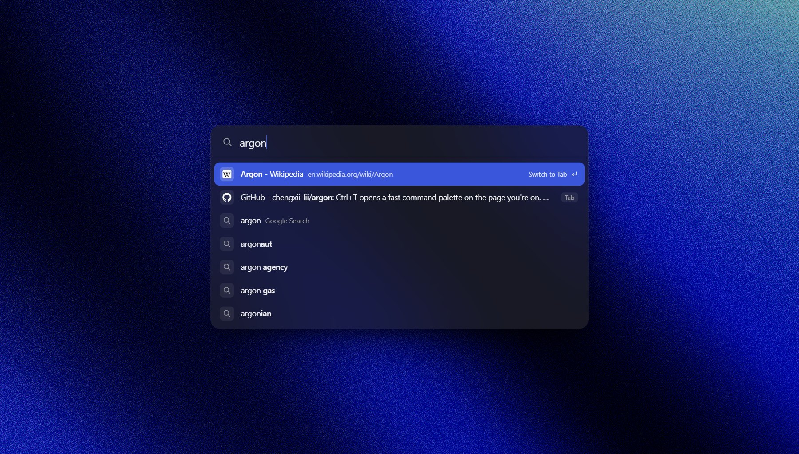
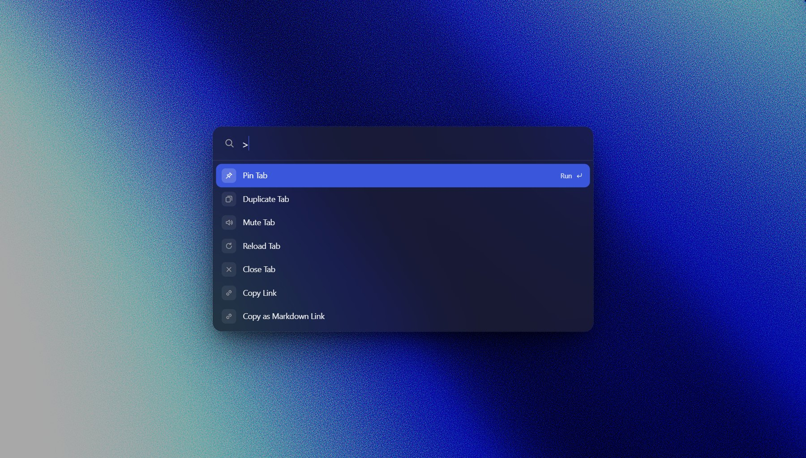
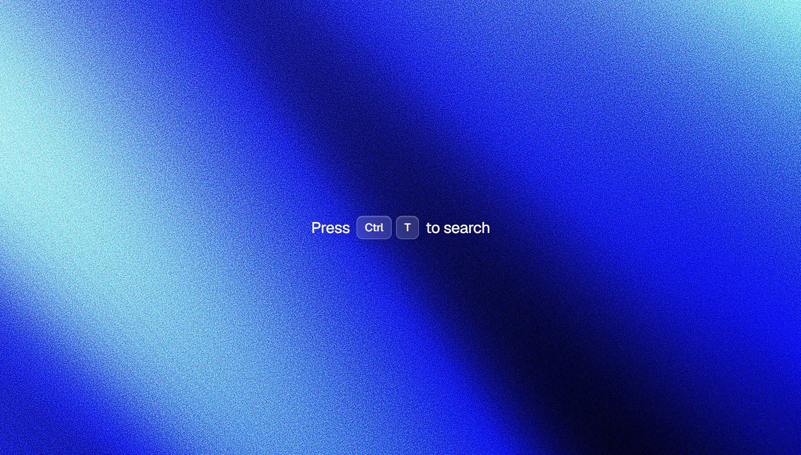
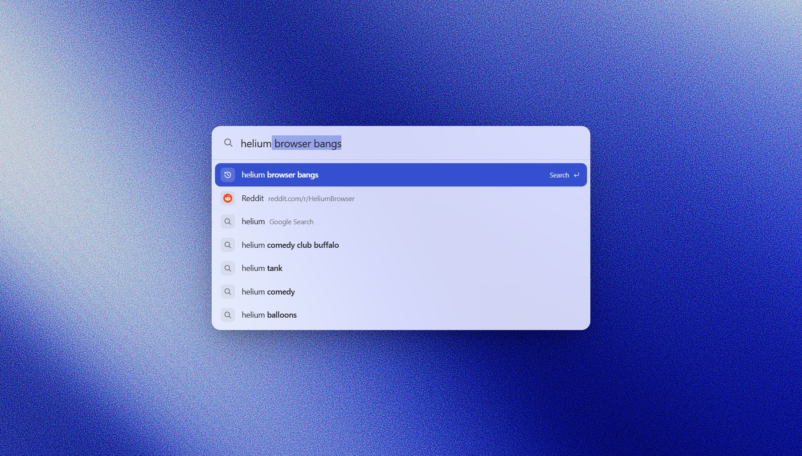

<div align="center">



<br>

[](https://github.com/chengxii-lii/argon/releases/latest)
[](https://helium.computer)
[](https://developer.chrome.com/docs/extensions/develop/migrate/what-is-mv3)
[](#privacy)
[](LICENSE)

**A command palette that opens right on the page you're on, instead of a new tab.**<br>
Your history first, Google always, and every one of Helium's !bangs.

[Install](#install) · [Features](#features) · [Keys](#keys) · [Privacy](#privacy)

</div>

<br>



## Why

Ctrl+T throws you onto a blank page just to type something. argon keeps you where you are: press Ctrl+T, type, hit Enter, and what you picked opens in a new tab, just like before. Only now the page you were reading is still behind the palette, and finding things again is instant.

## Features

<table>
<tr>
<td width="50%" valign="top">

### History first, then Google

Past searches and pages you've visited rank first, with inline autofill: `you` → **youtube.com**, `how to ce` → **how to center a div**. Searching Google for exactly what you typed is always the next row, followed by Google's live suggestions and calculator answers. A full address you type goes exactly where you typed.

</td>
<td width="50%" valign="top">



</td>
</tr>
<tr>
<td width="50%" valign="top">



</td>
<td width="50%" valign="top">

### Every Helium !bang

All 13,000+ bangs from **the same list Helium's address bar uses**, refreshed every few days. Put the bang first or last (`!yt lofi`, `lofi !yt`), exactly like Helium. As you type a bang, argon suggests matching bangs, and suggestions route through the bang's site.

</td>
</tr>
<tr>
<td width="50%" valign="top">



</td>
<td width="50%" valign="top">

### Your open tabs, too

Pages you already have open come up first and **switch** instead of opening twice. With nothing typed, the last few tabs you were on are right there. <kbd>Shift</kbd> <kbd>Delete</kbd> forgets a past search or page you don't want suggested again.

</td>
</tr>
<tr>
<td width="50%" valign="top">

### Commands, and a calculator

Type <kbd>&gt;</kbd> for tab and window commands: pin, mute, duplicate, picture-in-picture, copy link (or as Markdown), reopen closed tab, close others, zoom, and more. Or just type the command's name. Type math like `(3+4)^2/7` and the answer comes first; Enter copies it.

</td>
<td width="50%" valign="top">

' lists commands like Pin Tab, Duplicate Tab and Mute Tab">

</td>
</tr>
<tr>
<td width="50%" valign="top">



</td>
<td width="50%" valign="top">

### A calm new tab you can't lose

argon's new tab is just the gradient and a hint. Bind <kbd>Ctrl</kbd> <kbd>W</kbd> to argon and closing your last tab leaves this page instead of quitting the browser.

</td>
</tr>
<tr>
<td width="50%" valign="top">

### Fast, and out of your way

- Opens in about 10 ms, with no animations, and never waits on a sleeping background worker
- Anything you type before it appears still lands in the field
- Ranks your history in memory: under 1 ms per keystroke
- Dead center, a fixed seven rows tall, so nothing jumps around
- Page shortcuts (YouTube, GitHub, Gmail) never see what you type
- Follows light and dark mode, accented in Helium blue

</td>
<td width="50%" valign="top">



</td>
</tr>
</table>

## Install

1. Download **argon.zip** from the [latest release](https://github.com/chengxii-lii/argon/releases/latest) and unzip it. Or clone this repo.
2. Open `chrome://extensions`, turn on **Developer mode**, click **Load unpacked**, and pick the folder.
3. Open `chrome://extensions/shortcuts` and set argon's **Open the palette** to <kbd>Ctrl</kbd> <kbd>T</kbd>.<br>
   <sub>Browsers don't let an extension take Ctrl+T on its own. If another extension already uses it, clear that one first.</sub>
4. Optional: set **Close tab, but never your last one** to <kbd>Ctrl</kbd> <kbd>W</kbd>.<br>
   <sub>Closing a tab with its &times; button can't be caught by an extension, so that one still can close the window.</sub>

Works in any Chromium browser (Chrome, Edge, Brave, Arc). It's made for [Helium](https://helium.computer).

## Keys

| Key | Does |
| :-- | :-- |
| <kbd>Tab</kbd> / <kbd>Shift</kbd> <kbd>Tab</kbd> | Cycle through suggestions, filling the field as you go (also <kbd>↑</kbd> <kbd>↓</kbd>) |
| <kbd>Enter</kbd> | Open in a new tab, like Ctrl+T always did (a blank tab is reused; an open tab is switched to) |
| <kbd>Shift</kbd> <kbd>Enter</kbd> | Open in this tab |
| <kbd>Ctrl</kbd> <kbd>Enter</kbd> | Open in a background tab |
| <kbd>Alt</kbd> <kbd>Enter</kbd> | Search Google for exactly what you typed |
| <kbd>→</kbd> | Accept the autofill |
| <kbd>Shift</kbd> <kbd>Delete</kbd> | Forget the selected past search or page |
| <kbd>&gt;</kbd> | Commands: pin, mute, duplicate, copy link, reopen closed tab, zoom… |
| <kbd>Esc</kbd> | Close |

## How it works

- **On the page itself.** argon draws in a closed shadow root in the browser's top layer, so pages can't restyle it and it sits above everything, fullscreen video included. It listens for keys before the page does.
- **Where it can't draw.** Browser pages, the Web Store and the new tab page don't allow any extension in, so there the palette drops down from the toolbar icon. It does the same if you press Ctrl+T while the address bar has focus, since a page can't take focus from the toolbar.
- **Never waiting.** The browser swallows Ctrl+T's key press, but releasing the key still reaches the page, so argon opens the palette right there, without a round trip to its background worker. Meanwhile the tab you're using pings the worker every 20 seconds so it's never asleep, and any letters you type in between carry over into the field.
- **Bangs, the Helium way.** argon reads the first `!` that starts the text or follows a space, and fills `{searchTerms}` just as Chromium fills a search engine's template. The rules come from [Helium's own patch](https://github.com/imputnet/helium/blob/main/patches/helium/core/add-native-bangs.patch).

## Privacy

argon has no analytics, no accounts and no servers of its own. Your history is read locally and never leaves your browser. It makes only two kinds of requests:

| Request | Why |
| :-- | :-- |
| `suggestqueries.google.com` | Google suggestions for what you type, like any address bar |
| `services.helium.imput.net/bangs.json` | Helium's public bang list, every few days |

## Development

No build step: the folder *is* the extension. The scripts need Node 22+ and, for tests and art, Helium (or any Chromium; set `BROWSER=/path/to/browser`).

```bash
npm test         # 51 checks in a real headless browser with argon loaded
npm run bangs    # refresh data/bangs.json from Helium's list
npm run icons    # redraw the icons
npm run art      # re-render the README's banner, screenshots and demo GIF
```

A [weekly workflow](.github/workflows/bangs.yml) opens a pull request whenever Helium's bang list changes.

## Credits

- [Helium](https://github.com/imputnet/helium) by imput, for the browser and its bang list, which builds on [Kagi's bangs](https://github.com/kagisearch/bangs) (MIT)
- [ShaderGradient](https://shadergradient.co), for the gradients in this README and on the new tab
- [Geist](https://vercel.com/font) by Vercel, the new tab's font (SIL OFL 1.1)

## License

[MIT](LICENSE)
